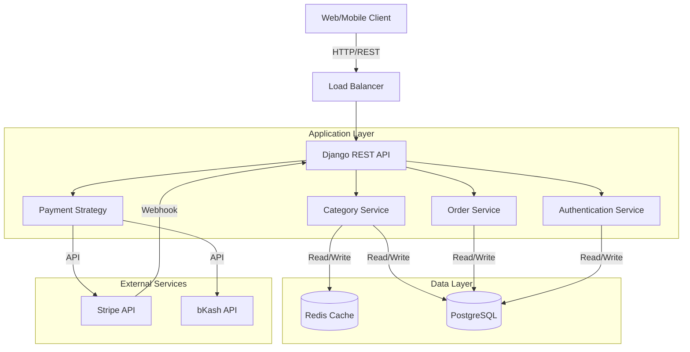

# System Architecture

```mermaid
graph TD
    Client[Web/Mobile Client] -->|HTTP/REST| LB[Load Balancer]
    LB --> API[Django REST API]
    
    subgraph "Application Layer"
        API --> Auth[Authentication Service]
        API --> Cat[Category Service]
        API --> Ord[Order Service]
        API --> Pay[Payment Strategy]
    end
    
    subgraph "Data Layer"
        Cat -->|Read/Write| Redis[(Redis Cache)]
        Cat -->|Read/Write| DB[(PostgreSQL)]
        Ord -->|Read/Write| DB
        Auth -->|Read/Write| DB
    end
    
    subgraph "External Services"
        Pay -->|API| Stripe[Stripe API]
        Pay -->|API| bKash[bKash API]
    end
    
    Stripe -->|Webhook| API
```
