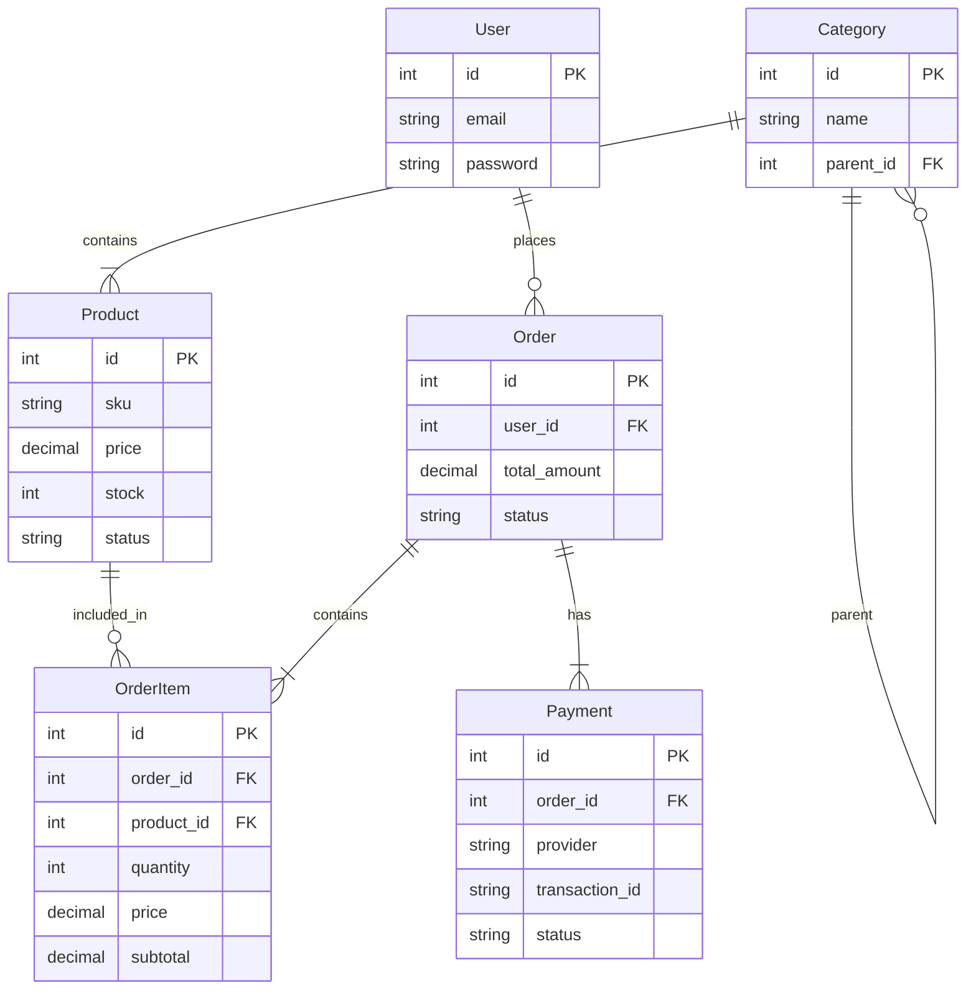

# Entity Relationship Diagram

```mermaid
erDiagram
    User ||--o{ Order : places
    User {
        int id PK
        string email
        string password
    }
    
    Category ||--|{ Product : contains
    Category ||--o{ Category : parent
    Category {
        int id PK
        string name
        int parent_id FK
    }
    
    Product ||--o{ OrderItem : included_in
    Product {
        int id PK
        string sku
        decimal price
        int stock
        string status
    }
    
    Order ||--|{ OrderItem : contains
    Order ||--|{ Payment : has
    Order {
        int id PK
        int user_id FK
        decimal total_amount
        string status
    }
    
    OrderItem {
        int id PK
        int order_id FK
        int product_id FK
        int quantity
        decimal price
        decimal subtotal
    }
    
    Payment {
        int id PK
        int order_id FK
        string provider
        string transaction_id
        string status
    }
```
