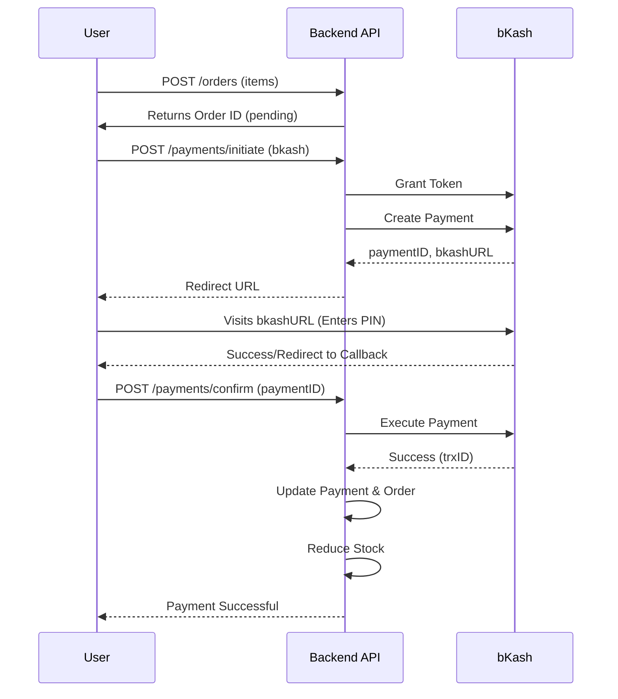

# bKash Payment Flow

```mermaid
sequenceDiagram
    participant User
    participant API as Backend API
    participant bKash
    
    User->>API: POST /orders (items)
    API->>User: Returns Order ID (pending)
    
    User->>API: POST /payments/initiate (bkash)
    API->>bKash: Grant Token
    API->>bKash: Create Payment
    bKash-->>API: paymentID, bkashURL
    API-->>User: Redirect URL
    
    User->>bKash: Visits bkashURL (Enters PIN)
    bKash-->>User: Success/Redirect to Callback
    
    User->>API: POST /payments/confirm (paymentID)
    API->>bKash: Execute Payment
    bKash-->>API: Success (trxID)
    API->>API: Update Payment & Order
    API->>API: Reduce Stock
    API-->>User: Payment Successful
```
