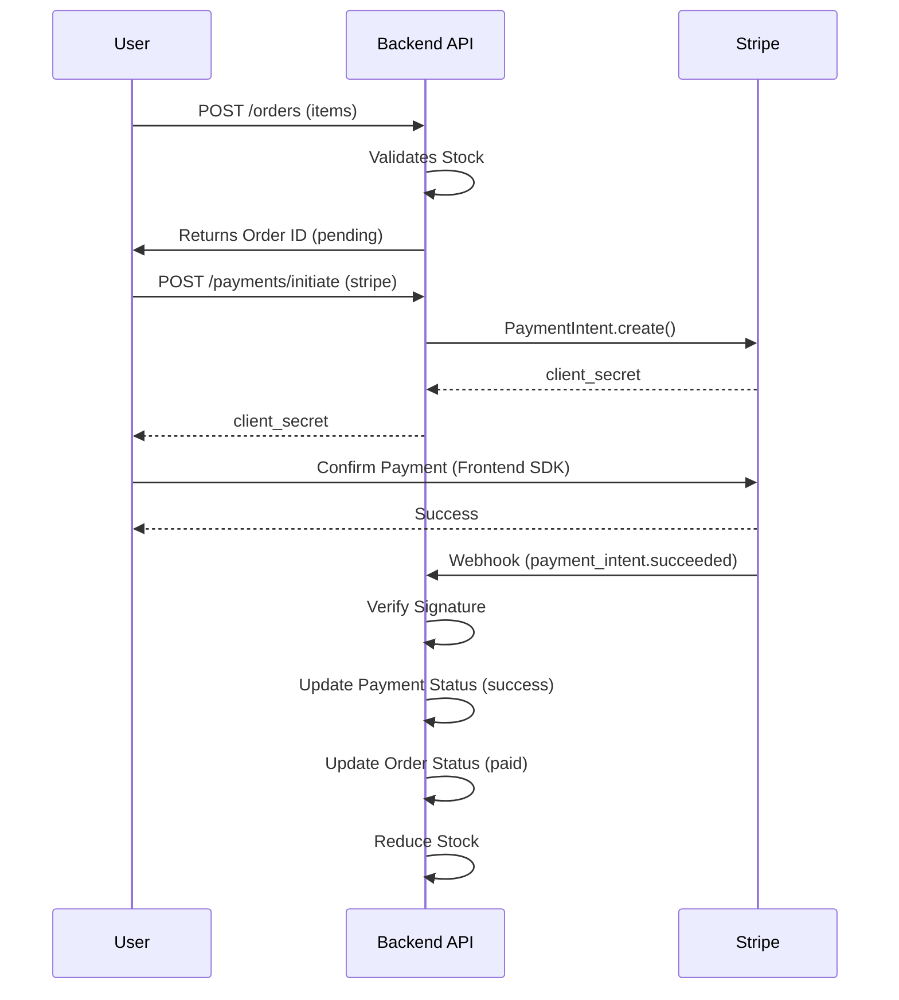

# Stripe Payment Flow

```mermaid
sequenceDiagram
    participant User
    participant API as Backend API
    participant Stripe
    
    User->>API: POST /orders (items)
    API->>API: Validates Stock
    API->>User: Returns Order ID (pending)
    
    User->>API: POST /payments/initiate (stripe)
    API->>Stripe: PaymentIntent.create()
    Stripe-->>API: client_secret
    API-->>User: client_secret
    
    User->>Stripe: Confirm Payment (Frontend SDK)
    Stripe-->>User: Success
    
    Stripe->>API: Webhook (payment_intent.succeeded)
    API->>API: Verify Signature
    API->>API: Update Payment Status (success)
    API->>API: Update Order Status (paid)
    API->>API: Reduce Stock
```
