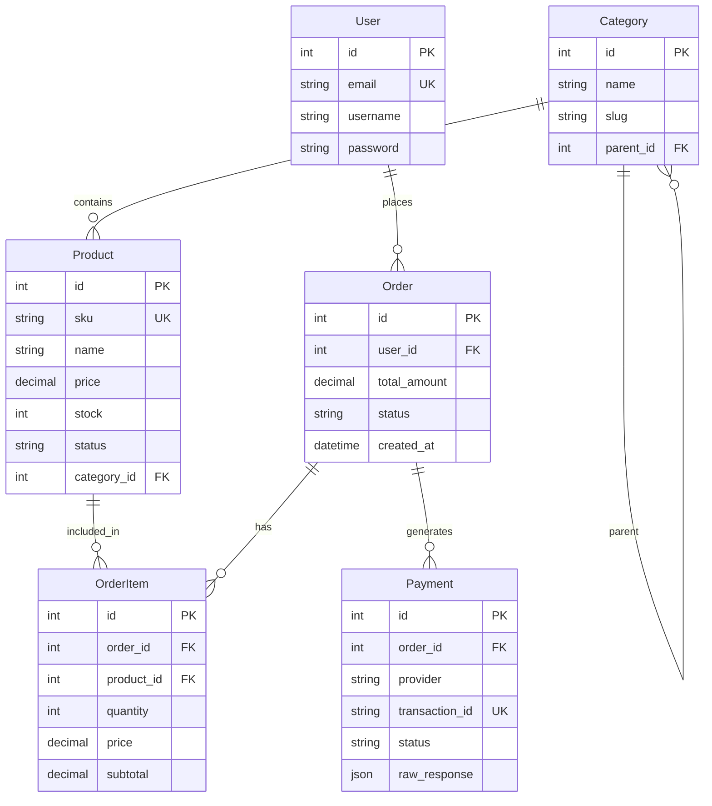
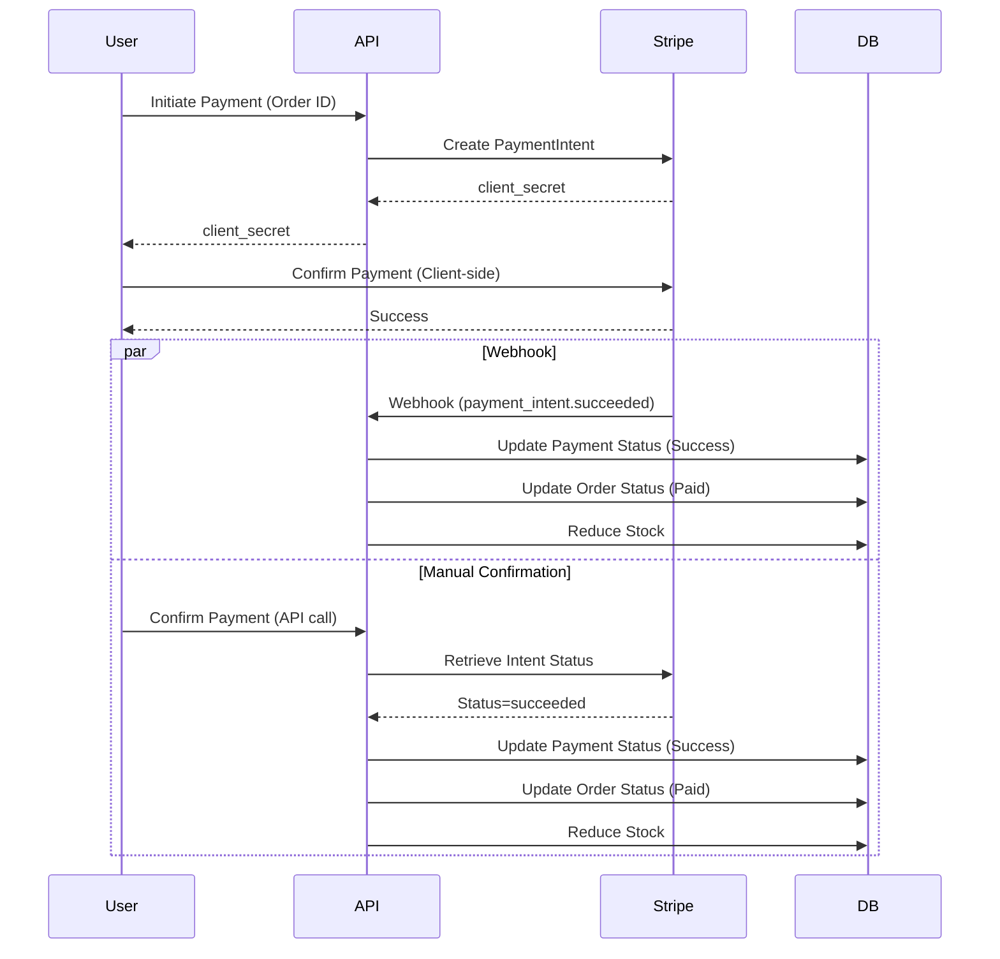
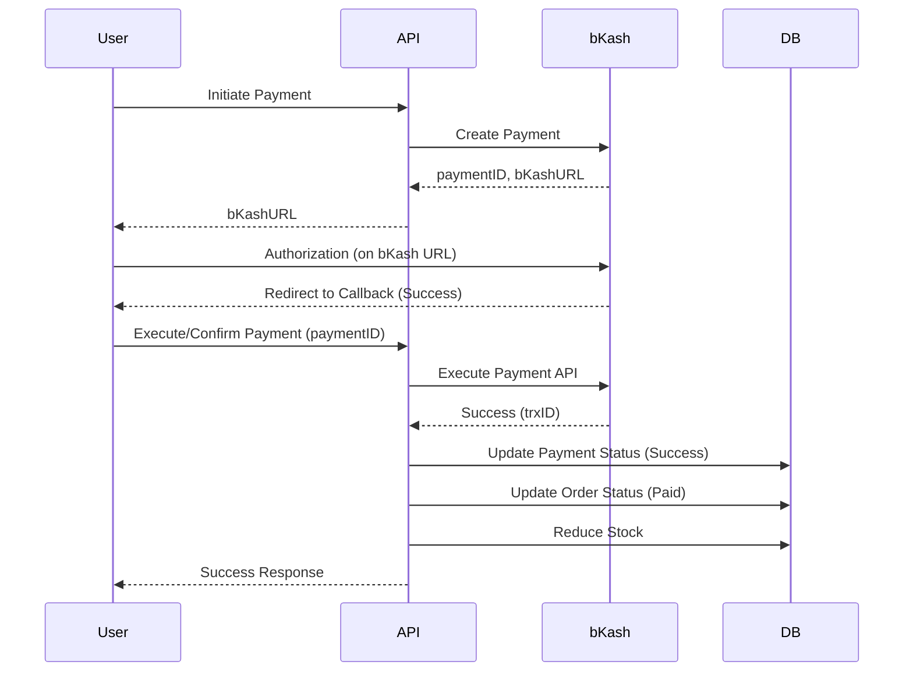

# System Design & Documentation

## 1. System Architecture

The system follows a modular Monolithic architecture using **Django REST Framework**.

```mermaid
graph TD
    Client[Client (Web/Mobile)] -->|HTTP/JSON| API[Django REST API]
    API -->|Auth| JWT[JWT Authentication]
    API -->|Reads/Writes| DB[(SQLite/PostgreSQL)]
    API -->|Caching| Redis[(Redis)]
    
    subgraph "Core Modules"
        User[User Management]
        Product[Product Management]
        Order[Order Management]
        Payment[Payment System]
    end
    
    API --> User
    API --> Product
    API --> Order
    API --> Payment
    
    Payment -->|Strategy Pattern| Stripe[Stripe Provider]
    Payment -->|Strategy Pattern| bKash[bKash Provider]
    
    Stripe -->|External API| StripeAPI[Stripe Cloud]
    bKash -->|External API| bKashAPI[bKash Cloud]
    
    Product -->|DFS Traversal| Redis
```

## 2. Entity Relationship Diagram (ERD)



## 3. Payment Flows

### Stripe Flow


### bKash Flow


## 4. Environment Configuration Guide

To set up the environment locally:

### Prerequisites
- Python 3.10+
- Redis (for caching)

### Steps

1.  **Clone the Repository**
    ```bash
    git clone <repo_url>
    cd <repo_name>
    ```

2.  **Create Virtual Environment**
    ```bash
    python -m venv venv
    source venv/bin/activate  # Linux/Mac
    # venv\Scripts\activate   # Windows
    ```

3.  **Install Dependencies**
    ```bash
    pip install -r requirements.txt
    ```

4.  **Configuration (.env)**
    Create a `.env` file in the root directory:
    ```ini
    DEBUG=True
    SECRET_KEY=your_secret_key_here
    ALLOWED_HOSTS=localhost,127.0.0.1
    
    # Database (Optional, defaults to SQLite)
    # DB_NAME=...
    
    # Redis
    REDIS_URL=redis://127.0.0.1:6379/1
    
    # Stripe Keys
    STRIPE_PUBLISHABLE_KEY=pk_test_...
    STRIPE_SECRET_KEY=sk_test_...
    STRIPE_WEBHOOK_SECRET=whsec_...
    
    # bKash Keys
    BKASH_APP_KEY=...
    BKASH_APP_SECRET=...
    BKASH_USERNAME=...
    BKASH_PASSWORD=...
    BKASH_BASE_URL=https://tokenized.sandbox.bka.sh/v1.2.0-beta
    ```

5.  **Run Migrations**
    ```bash
    python manage.py migrate
    ```

6.  **Seed Data** (Creates Admin & Products)
    ```bash
    python seed_data.py
    ```

7.  **Run Server**
    ```bash
    python manage.py runserver
    ```

8.  **Access Documentation**
    -   Swagger UI: `http://localhost:8000/api/docs/`
    -   Redoc: `http://localhost:8000/api/schema/`

## 5. Requirement Verification Traceability

| Requirement | Implementation Location/Details |
| :--- | :--- |
| **Clean REST API** | Django Rest Framework, ViewSets in `api/views/`, URL router in `api/urls.py` |
| **Migrations** | `api/migrations/` (Managed by Django) |
| **Data Validation** | Serializers in `api/serializers/` (e.g., `OrderCreateSerializer`, `ProductSerializer`) |
| **Secure API Keys** | `python-decouple` used in `settings.py` to read from `.env` |
| **Logging** | Configured in `settings.py` (LOGGING dict) |
| **Scalable Schema** | Relational Models, Strategy Pattern for Payments (`api/payments/`) |
| **OOP Classes** | `User`, `Product`, `Order`, `Payment` Models + `BasePaymentProvider` abstract class |
| **Indexes** | `Meta.indexes` in Models (`Product`, `Order`, `Payment`) |
| **Deterministic Algo** | `Order.calculate_total`, `Product.reduce_stock` |
| **Strategy Pattern** | `PaymentFactory` returning `StripePaymentProvider` or `BkashPaymentProvider` |
| **DFS + Caching** | `CategoryService.get_descendants_ids` (DFS) + `get_cached_tree` (Redis) |
